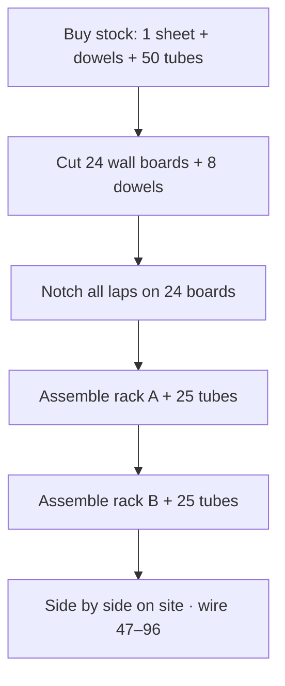
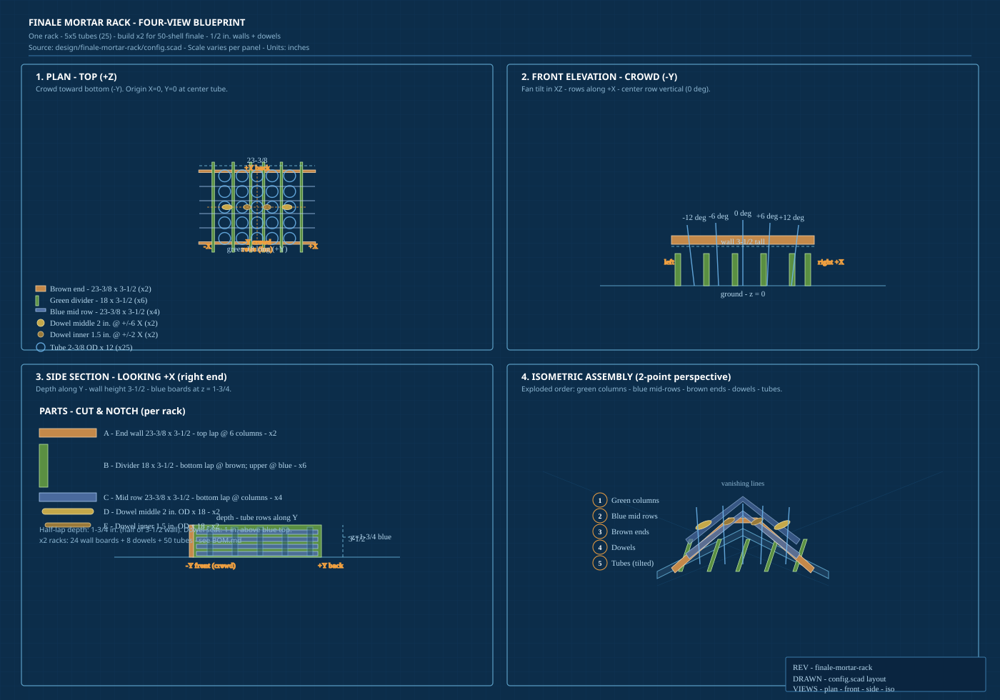
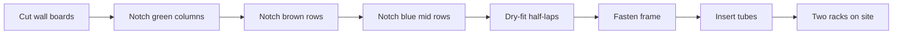

# Finale Mortar Rack

Five-row fan rack sized for **50 tubes** (5×5 per rack × 2 racks) — matches the Commander finale block **(47–96)/96** in `data/firing-sequence.csv`.

**Bill of materials:** [`BOM.md`](BOM.md) · [`data/finale-rack-bom.json`](../../data/finale-rack-bom.json) (also on the web design board)

## Building two racks

The show needs **two identical racks** (25 tubes each). OpenSCAD `rack.scad` previews **one** rack; every cut quantity in the BOM is listed **per rack** and **×2 for both**.

### What to buy (both racks)

| Material | Amount |
|----------|--------|
| 4×8 sheet, 1/2 in. thick | **1 sheet** — 4 brown + 12 green + 8 blue wall boards |
| 2 in. dowel rod | **≥6 ft** — 4× middle dowels @ 17-7/8 in. |
| 1-1/2 in. dowel rod | **≥6 ft** — 4× inner dowels @ 17-7/8 in. |
| Mortar tubes (2-3/8 in. OD × 12 in.) | **50** (25 per rack) |
| Class C 2 in. shells | **50** (finale cues 47–96) |

### Shop workflow

1. **Lay out cuts** — Use the [cut list in `BOM.md`](BOM.md#cut-list--two-racks-build-qty). Cut all **24** wall board blanks before notching (same sizes repeat rack to rack).
2. **Notch** — Follow the [assembly order](#assembly-order) below: green columns → brown ends → blue mid rows. Half-lap depth is **1-3/4 in.** (half of 3-1/2 in. wall height).
3. **Dowels** — Rip or buy **2 in.** and **1-1/2 in.** rod; cut eight pieces to **17-7/8 in.** Match `row-dowel-top-middle.scad` and `row-dowel-top-inner.scad`.
4. **Assemble rack A** — Dry-fit half-laps → fasten → install **4 dowels** (middle ±6 in. X, inner ±2 in. X) → load **25 tubes** with column tilt per [row angles](#row-angles).
5. **Assemble rack B** — Repeat step 4. Mark **A** / **B** on the frame if you split shell numbers between racks.
6. **Field** — Place racks **side by side** (fan along **+X**). Wire per `data/firing-sequence.csv` (e.g. shells **47–71** on A, **72–96** on B, or mirror your fuse layout).



### Per-rack part count

| Category | Qty / rack | ×2 racks |
|----------|------------|----------|
| Brown end walls | 2 | 4 |
| Green dividers | 6 | 12 |
| Blue mid row dividers | 4 | 8 |
| Middle dowel (2 in. OD) | 2 | 4 |
| Inner dowel (1.5 in. OD) | 2 | 4 |
| Tubes | 25 | 50 |

## Tubes

| | |
|---|---|
| Outer diameter | 2-3/8 in. (2.375 in.) |
| Length | 12 in. |
| Shell | Class C **2 in.** mortars |

## Row angles

Tubes tilt **left/right** from vertical in the plane toward the crowd (not forward/back). The **center row** is straight up (0°). Each row outward is **halfway** between the center angle and the outside row on that side:

| Row | Tilt | From vertical |
|-----|------|----------------|
| 1 — Outer left | Left | **−12°** |
| 2 — Inner left | Left | **−6°** (half of 12°) |
| 3 — Center | — | **0°** |
| 4 — Inner right | Right | **+6°** |
| 5 — Outer right | Right | **+12°** |

Total fan spread: **24°** (±12°). Adjust `outer_angle_deg` in `config.scad` (and `data/finale-rack.json`) — **10–15°** is typical for consumer 2 in. racks; 12° is a conservative default.

## Layout

- **5 rows** × **5 tubes** = 25 per rack (50 total with two racks)  
- **Rows** run left–right (**+X**): outer left → center → outer right  
- **Tubes in each row** run front–back (**+Y**)  
- **Tilt** is rotation about the **Y axis** (fan in the XZ plane), not about X  

Row/column spacing: **3.125 in.** center-to-center (tube OD + 1/2 in. divider + 1/4 in. gap) → **2.625 in.** clear opening per cell  

### Column positions (`config.scad`)

Rack center is **X = 0**. Tune each column independently:

| Array | Count | Meaning |
|-------|-------|---------|
| `column_tube_offset_from_center_in` | 5 | Tube centerline X per column (0–4) |
| `divider_offset_from_center_in` | 6 | Green divider centerline X — `[0]` left side … `[5]` right side |
| `row_dowel_x_offset_from_center_in` | 4 | Top dowel centerline **X** (with `row_dowel_bay_i` / `row_dowel_tube_column_i`) |
| `row_dowel_od_middle_in` / `row_dowel_od_inner_in` | — | OD for `row-dowel-top-middle.scad` / `row-dowel-top-inner.scad` |
| `row_dowel_middle_i` / `row_dowel_inner_i` | — | Indices into the arrays above per dowel type |
| `depth_tube_offset_from_center_in` | 5 | Tube centerline Y along each row (front → back) |
| `end_wall_inner_offset_from_center_y` | 2 | Brown end wall **inner face** Y — `[front, back]` |

Negative X = left; negative Y = front. Rack origin is **X = 0, Y = 0** (center column / center tube along depth). Footprint width spans divider `[0]`–`[5]` inner faces; brown ends wrap the outer faces of those two side dividers.

Defaults restore the prior 2-1/2 in. center slot (`divider` 1 & 2 at ±1.5 in.) and middle L/R tubes bottom-flush to those boards.

All six green dividers share the same cut (**17-7/8 × 3-1/2 in.** with `column_board_extension_in`); only X positions differ. Row and column boards are **3-1/2 in.** tall (`wall_height_in`). At crossings, **columns** lose the **bottom** half and **brown rows** lose the **top** half (`column_end_half_lap`).

**Second layer:** four **blue** mid-height row dividers run front–back (like brown ends) between tube rows along **Y**, starting at **z = 1-3/4 in.** (half column height). Height **3-1/2 in.** (same as columns); **bottom** half notched at each column X; columns lose the **top** of their upper band at those Y positions (`middle_row_half_lap`).

**Top dowels:** two primitives — `row-dowel-top-middle.scad` (**2 in.** OD, ±6 in. X) and `row-dowel-top-inner.scad` (**1.5 in.** OD, ±2 in. X). Each is a cylinder along **+Y** with its origin at the geometric center. `rack.scad` places **four** instances via `row_dowel_middle_i` / `row_dowel_inner_i`, `row_dowel_x_offset_from_center_in`, and `row_dowel_center_z_in(i)`. Length **17-7/8 in.** (green boards). Tubes are cut per instance.

## Blueprints

### Four-view sheet (parts + assembly)

Print or zoom [`blueprint.svg`](blueprint.svg) — one sheet with **four orthographic/perspective views** and a parts cut legend:

| Panel | View | Shows |
|-------|------|--------|
| ① | **Plan** (top, +Z) | Brown ends, six green columns, four blue mid-rows, tube grid, dowel X positions |
| ② | **Front elevation** (crowd, −Y) | Fan tilt ±12° / ±6° / 0° by column; wall height 3-1/2 in. |
| ③ | **Side section** (+X) | Depth along Y; blue boards at z = 1-3/4 in.; half-lap bands |
| ④ | **Isometric assembly** | Exploded build order (columns → blue → brown → dowels → tubes) with vanishing guides |

Open in a browser or vector editor; dimensions match `config.scad`. Build **two identical racks** from the same drawing (double part qty in [`BOM.md`](BOM.md)).



Axes (rack origin **X = 0, Y = 0** at center column / center depth tube):

| Axis | Direction |
|------|-----------|
| **+X** | Right (outer right row) |
| **+Y** | Back (away from crowd) |
| **+Z** | Up (tube points up) |

### Plan view (top — construction layout)

One rack; build **two identical** units for 50 tubes. Brown = end row boards (front/back). Green = column boards (six along X). Blue = mid-height row dividers (four between tube rows along Y).

```
        -X (left)                              +X (right)
          |                                        |
    G     |   o    o    o    o    o                |     G   ← column [0] / [5] = side walls
    |     |                                        |     |
    G  |  |   o    o    o    o    o                |  |  G   ← columns [1]–[4]
    |  |  |                                        |  |  |
    G  |  |   o    o    o    o    o                |  |  G
    |  |  |                                        |  |  |
    G  |  |   o    o    o    o    o                |  |  G
    |  |  |  ===== blue mid row (z = 1-3/4) =====  |  |  |
    G  |  |   o    o    o    o    o                |  |  G
    |  |  |  ===== blue mid row =================  |  |  |
    G  |  |   o    o    o    o    o                |  |  G
    |     |                                        |     |
          |======== brown front row (-Y) ==========|       ← 23-3/8 × 3-1/2 in.
          |                                        |
          |======== brown back row (+Y) ===========|

  o = tube (2-3/8 in. OD × 12 in.), tilted ±12° / ±6° / 0° by column
```

**Divider centerlines X (in):** −9, −5, −1.5, +1.5, +5, +9  
**Tube centerlines X (in):** −6.5, −3, 0, +3, +6.5  
**Tube centerlines Y per row (in):** −6.25, −3.125, 0, +3.125, +6.25  

### Half-lap joint (section at front or back crossing)

Board height **3-1/2 in.** Lap depth **1-3/4 in.** (half height). Column boards carry the load from the bottom; row boards cap from the top.

```
  side view at one column × row intersection (looking along +X)

       row board (brown)          column board (green)
       ┌─────────────┐            ┌──┐
       │  top half   │            │  │  top half (1-3/4) — column
       │  NOTCHED    ├────────────┤  │
       │  away       │  interlock │  │
       ├─────────────┤            │  │
       │  bottom     │            ├──┤  bottom half NOTCHED away
       │  remains    │            │  │  on column
       └─────────────┘            └──┘
            z=0 ─────────────────────── slab bottom (ground)
```

| Board | Notch location | Material removed |
|-------|----------------|------------------|
| Green column (×6) | Front & back brown crossings | **Bottom** 1-3/4 in. × 1/2 in. × board thickness |
| Brown row (×2) | Each of six column X positions | **Top** 1-3/4 in. × 1/2 in. × board thickness |
| Blue mid row (×4) | Each of six column X positions | **Bottom** 1-3/4 in. × 1/2 in. (half of 3-1/2 board) |
| Green column (×6) | Four blue row Y centerlines | **Top** 7/8 in. of upper band (z = 2-5/8 to 3-1/2) |

**Mid-height crossing (side view):**

```
  z=5.25 ─┤  blue row (extends above column top)
  z=3.5  ─┤     ┌── column upper lap removed ──┐
  z=2.625┤     │    interlock with blue row    │
  z=1.75 ├─────┴── blue row bottom notched ───┘
  z=0    └──────── brown / column lower laps ───
```

### Assembly order (repeat for each rack)

1. **Cut** — per [`BOM.md`](BOM.md): 2× brown **23-3/8 × 3-1/2**, 6× green **17-7/8 × 3-1/2**, 4× blue **23-3/8 × 3-1/2**, 2× middle dowel **2 in. OD × 17-7/8**, 2× inner dowel **1.5 in. OD × 17-7/8**.
2. **Notch columns** — bottom-half at front/back; top-of-upper-half at four mid-row Y (`column-board-bottom.scad`).
3. **Notch brown rows** — top-half at all six column X (`row-board-bottom.scad`).
4. **Notch blue rows** — bottom-half at all six column X (`row-board-middle.scad`).
5. **Dry-fit** — six green columns → four blue mid rows → brown front/back.
6. **Fasten** — screw or bolt through laps (pilot for 1/2 in. wall thickness); keep column/brown tops flush at **z = 0** for tube seating.
7. **Dowels** — middle (±6 in. X) then inner (±2 in. X); bottom **1 in.** above blue board tops.
8. **Tubes** — insert 25 tubes; tilt columns per [row angles](#row-angles).
9. **Second rack** — repeat steps 1–8; label **A** / **B** if needed.
10. **Field** — both racks side by side; wire shells **47–96** per `data/firing-sequence.csv`.



### 3D reference

| Preview file | Shows |
|--------------|-------|
| `column-board-bottom.scad` | Six green boards + end/mid notches |
| `row-board-bottom.scad` | Two brown boards + top notches |
| `row-board-middle.scad` | Four blue mid-height row dividers |
| `row-dowel-top-middle.scad` | Middle dowel primitive (2 in. OD) |
| `row-dowel-top-inner.scad` | Inner dowel primitive (1.5 in. OD) |
| `rack.scad` | Full frame + tubes + 4× dowel placement |

## Structure

| Part | Size |
|------|------|
| Brown end walls (front & back) | **23-3/8 × 3-1/2 in.** (`end_wall_extension_in` +1 in./side in X) |
| Green dividers (6 along +X) | 1/2 in. × **17-7/8 × 3-1/2 in.** |
| Blue mid row dividers (4 along Y) | **23-3/8 × 3-1/2 in.** (starts at z = 1-3/4) |
| Dowels middle (2/rack) | **2 in.** OD × **17-7/8 in.** (`row-dowel-top-middle.scad`, ±6 in. X) |
| Dowels inner (2/rack) | **1.5 in.** OD × **17-7/8 in.** (`row-dowel-top-inner.scad`, ±2 in. X) |

Footprint widens **~2-3/4 in.** per side for fan tilt so tubes do not hit the side dividers.

## OpenSCAD

```bash
openscad design/finale-mortar-rack/rack.scad
openscad design/finale-mortar-rack/row-board-bottom.scad
openscad design/finale-mortar-rack/column-board-bottom.scad
openscad design/finale-mortar-rack/row-board-middle.scad
openscad design/finale-mortar-rack/row-dowel-top-middle.scad
openscad design/finale-mortar-rack/row-dowel-top-inner.scad
```

| File | Role |
|------|------|
| `config.scad` | Tubes, angles, divider/tube offsets, extensions |
| `layout.scad` | Derived footprint and centerline helpers (include after `config.scad`) |
| `row-board-bottom.scad` | Brown front/back boards + half-lap (self-contained preview) |
| `column-board-bottom.scad` | Six green dividers + half-lap (self-contained preview) |
| `row-board-middle.scad` | Four mid-height row dividers (self-contained preview) |
| `row-dowel-top-middle.scad` | Middle dowel (self-contained preview) |
| `row-dowel-top-inner.scad` | Inner dowel (self-contained preview) |
| `rack.scad` | Full assembly (all board layers + optional tubes) |
| `blueprint.svg` | Four-view construction blueprint (parts + assembly) |

Edit `config.scad` for angles, divider/tube positions, and wall height.

## Web board

Spec for the site: `data/finale-rack.json` (Finale Rack section on the design board).
